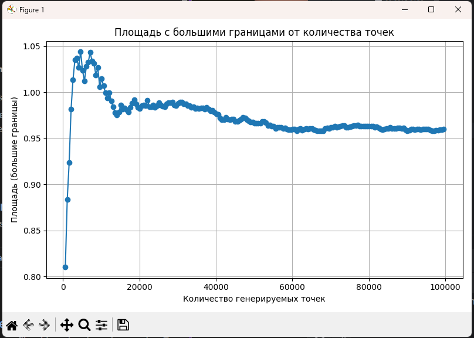

# Отчет по решению задачи A1

## Репозиторий с данными
[Репозиторий](https://github.com/Corsiw/Data-Structures-and-Algorithms)

## 1. Реализация алгоритма Монте-Карло
Реализовал требуемый алгоритм на `C++`. Использовал следующие константные параметры:

```c++
constexpr uint64_t kSeed = 52426967;
constexpr uint64_t kNumberOfPoints = 100000;
```
Также использовал пересечение `Bounding box` 3 кругов, а не `Bounding box` трех кругов сразу для формирования границ генерации точек.

Номер посылки `347601512`.
Сам код можно увидеть -> [A1i.cpp](A1i.cpp).

## 2. Экспериментальные замеры
Немного поменяв код из решения, получил [A1.cpp](A1.cpp), который сгенерировал [out.csv](out.csv),
где столбцы слева направо:
`Количество генерируемых точек` `Площадь с большими границами` `Отлонение от реальной площади` `Площадь с маленькими границами` `Отклонение от реальной площади`.

В качестве большой границы использовал бокс для всех 3 кругов, в качестве маленькой, бокс для их пересечения.
Написал `Python` скрипт, который строит графики по данным из `csv` ->
[graph.py](graph.py)

### Результаты



## 3. Сравнительный анализ полученных данных
По графикам можно сделать несколько выводов:
1. Зависимость точности от числа точек экспоненциальна.
Увеличение количества генерируемых точек значительно повышает точность оценки площади, особенно на начальных этапах (при малом числе точек). Однако после определённого порога прирост точности становится всё менее заметным.

2. Размер границ существенно влияет на погрешность.
При больших границах приближённая площадь имеет более сильные колебания и более высокую относительную ошибку. Это связано с тем, что при больших диапазонах разброс точек больше, и влияние случайных отклонений выше.

3. При маленьких границах метод более устойчив.
Меньшие границы обеспечивают более компактную область генерации точек, что снижает вариативность результата и делает оценку площади более точной даже при небольшом числе точек.

4. Для задачи моделирования площадей методом Монте-Карло, важно подбирать не только достаточное количество точек, но и оптимальные границы области, чтобы минимизировать ошибку без чрезмерного увеличения вычислительных затрат.