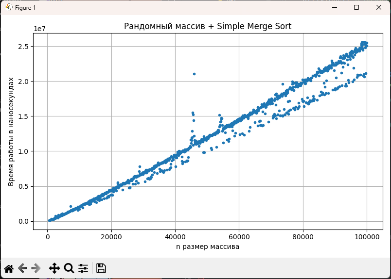
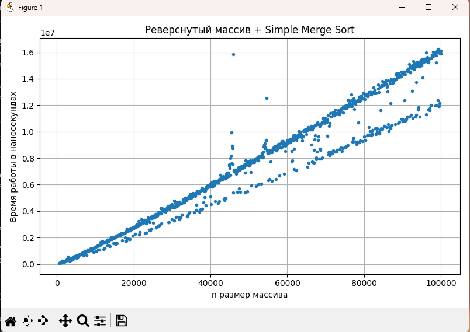
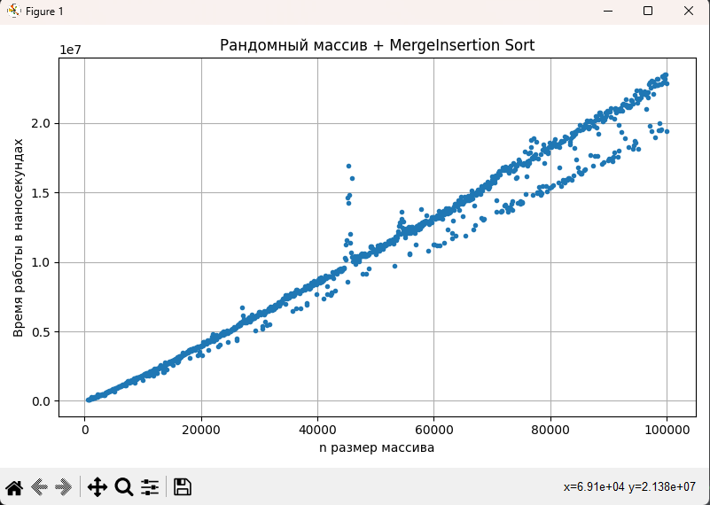
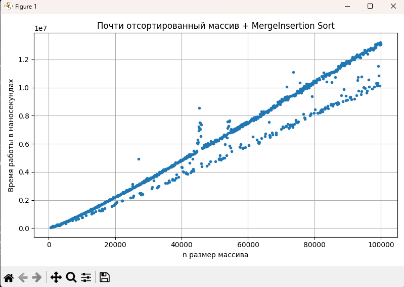

# Отчет по решению задачи A2

## Репозиторий с данными
[Репозиторий](https://github.com/Corsiw/Data-Structures-and-Algorithms)

## 0. Анализ Merge+Insertion Sort
Реализовал требуемый алгоритм на `C++`. Использовал переход при размере подмассива <= 15:

Номер посылки `347609895`.
Сам код можно увидеть -> [A2i.cpp](A2i.cpp).

## 1. Подготовка тестовых данных
Реализовал класс ArrayGenerator для генерации тестовых массивов
с ограничениями, заданными в условии задачи.

Реализовал класс SortTester, который замеряет время выполнения переданного алгоритма
на переданном массиве в наносекундах 20 раз и берет медиану.

Сам код можно увидеть -> [A2.cpp](A2.cpp)

## 2. Эмпирический анализ
Провел анализ и сформировал `csv` файл [out.csv](out.csv). Структура: `Число элементов массива`
`Рандомный + Simple` `Реверс + Simple` `Отсортированный + Simple` `Рандомный + MergeInsertion` `Реверс + MergeInsertion`
`Отсортированный + MergeInsertion`
Параметр переключения на *InsertionSort* - 15.
Написал `Python` скрипт, который строит графики по данным из `csv` ->
[graph.py](graph.py)

### Результаты

## 3. Сравнительный анализ полученных данных

### Общие наблюдения

* Для **всех типов входных данных** модифицированный алгоритм **MergeInsertion** показывает **меньшее или сравнимое время** по сравнению с классическим MergeSort.
* На **мелких размерах массива** разница может быть незначительной из-за накладных расходов на переключение между методами.
* С ростом числа элементов преимущество **MergeInsertion** становится **более выраженным**, особенно на неотсортированных данных.

### Сравнение по типам входных данных

| Тип массива               | Наблюдения                                                                                                                                                                        |
|---------------------------| --------------------------------------------------------------------------------------------------------------------------------------------------------------------------------- |
| **Рандомный**             | MergeInsertion в среднем быстрее на 10–25 %, поскольку вставки эффективно обрабатывают маленькие подмассивы, снижая число рекурсивных вызовов.                                    |
| **Реверсированный**       | Выигрыш от модификации заметен, но меньше: при обратном порядке вставки часто выполняют много сдвигов.                                                                            |
| **Почти отсортированный** | Оба алгоритма работают значительно быстрее, но MergeInsertion всё же показывает небольшое преимущество — сортировка вставками почти сразу завершает обработку мелких подмассивов. |

### Выводы

1. **Гибридная версия (MergeSort + InsertionSort)** демонстрирует **лучшую производительность** на большинстве типов входных данных.
2. Основное преимущество достигается за счёт того, что сортировка вставками эффективна на малых подмассивах, где рекурсивный вызов MergeSort был бы избыточен.
3. **На больших объёмах данных** разница между реализациями становится **более заметной**, особенно при случайных данных.
4. Таким образом, использование порогового значения (например, `n ≤ 15`) для переключения на InsertionSort является **оптимальным компромиссом** между простотой реализации и скоростью.
