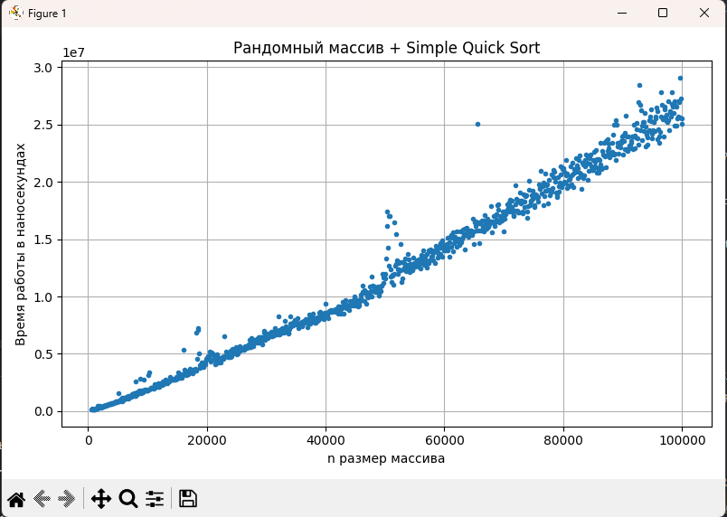
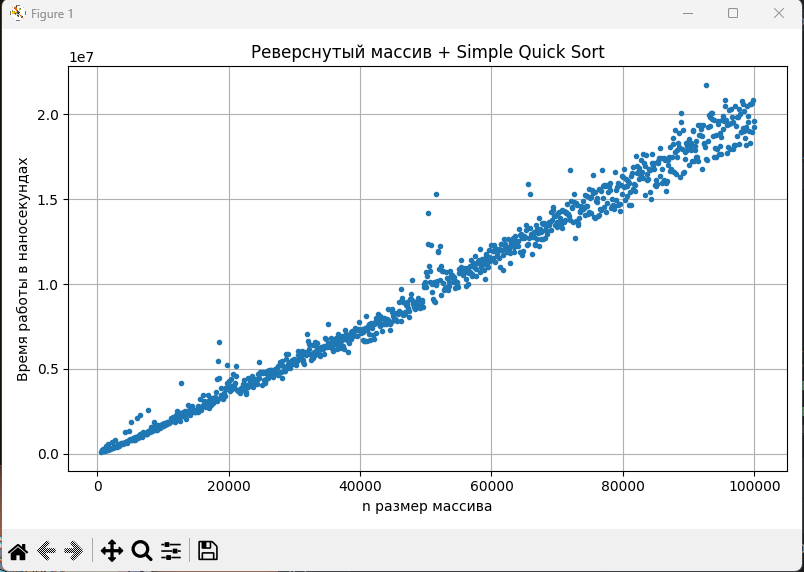
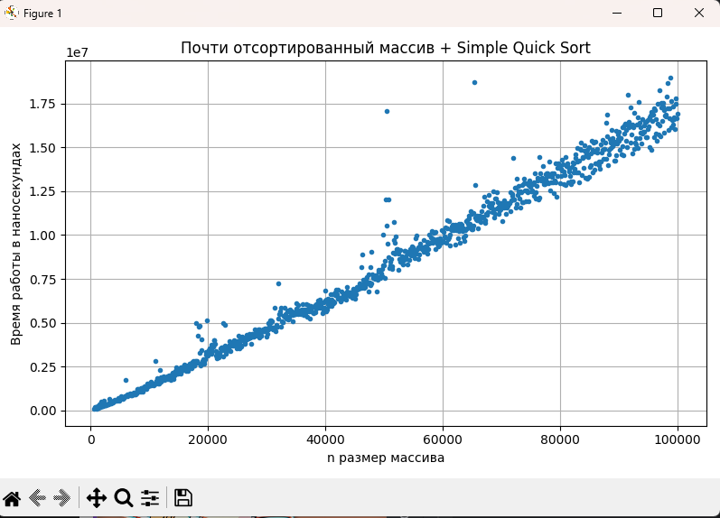
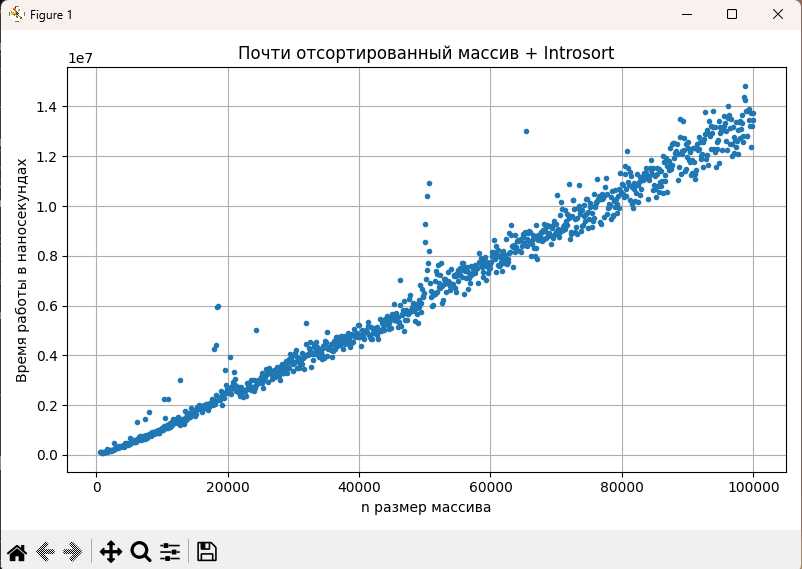

# Отчет по решению задачи A3b

## Репозиторий с данными
[Репозиторий](https://github.com/Corsiw/Data-Structures-and-Algorithms)

## 0. Анализ IntroSort
Реализовал требуемый алгоритм на `C++`. Использовал переход на InsertionSort при размере подмассива < 16 и на HeapSort на глубине рекурсии $2 \cdot \log_2N$:

Номер посылки `347671876`.
Сам код можно увидеть -> [A3i.cpp](A3i.cpp).

## 1. Подготовка тестовых данных
Реализовал класс ArrayGenerator для генерации тестовых массивов
с ограничениями, заданными в условии задачи.

Реализовал класс SortTester, который замеряет время выполнения переданного алгоритма
на переданном массиве в наносекундах 20 раз и берет медиану.

Сам код можно увидеть -> [A3.cpp](A3.cpp)

## 2. Эмпирический анализ
Провел анализ и сформировал `csv` файл [out.csv](out.csv). Структура: `Число элементов массива`
`Рандомный + Simple` `Реверс + Simple` `Отсортированный + Simple` `Рандомный + IntroSort` `Реверс + IntroSort`
`Отсортированный + IntroSort`
Параметр переключения на *InsertionSort* - 16, на *HeapSort* - достижение глубины рекурсии $2 \cdot \log_2N$.
Написал `Python` скрипт, который строит графики по данным из `csv` ->
[graph.py](graph.py)

### Результаты

## 3. Сравнительный анализ полученных данных

### Общие наблюдения

* Для **всех типов входных данных** алгоритм **IntroSort** показывает **меньшее или сравнимое время** по сравнению с классическим QuickSort.
* На **мелких размерах массива** ~5000 разница может быть незначительной из-за накладных расходов на переключение между методами.
* С ростом числа элементов преимущество **IntroSort** становится **более выраженным**, достигая 40% на некоторых типах входных данных.

### Сравнение по типам входных данных

| Тип массива               | Наблюдения                                                                                                                                                               |
|---------------------------|--------------------------------------------------------------------------------------------------------------------------------------------------------------------------|
| **Рандомный**             | IntroSort в среднем быстрее на 20–25%, поскольку вставки эффективно обрабатывают маленькие подмассивы, снижая число рекурсивных вызовов.                                 |
| **Реверсированный**       | Выигрыш IntroSort еще заметнее - 40-50% из-за неудачных выборов опорных элементов и приближению к квадратичной сложности и линейной глубины рекурсии для QuickSort.      |
| **Почти отсортированный** | Оба алгоритма работают значительно быстрее, но IntroSort всё же показывает преимущество в 20% — сортировка вставками почти сразу завершает обработку мелких подмассивов. |

### Выводы

1. **Гибридная версия (IntroSort)** демонстрирует **лучшую производительность** на большинстве типов входных данных.
2. Основное преимущество достигается за счёт того, что сортировка вставками эффективна на малых подмассивах, где рекурсивный вызов Quick был бы избыточен, а также за счет избавления от неудачных случайных выборов опорных в QuickSort за счет использования HeapSort.
3. **На больших объёмах данных** разница между реализациями становится **более заметной**, особенно при случайных данных и отсортированных невозрастанию данных.