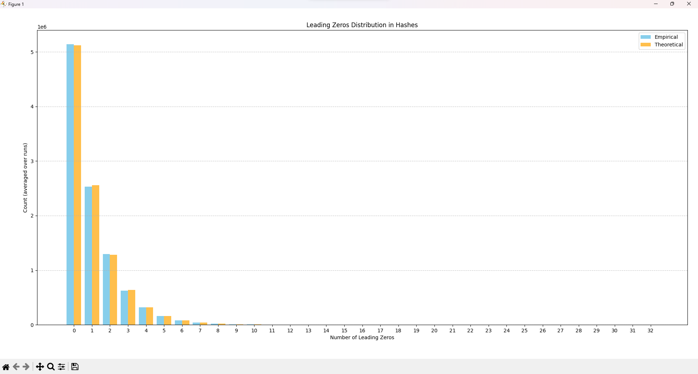
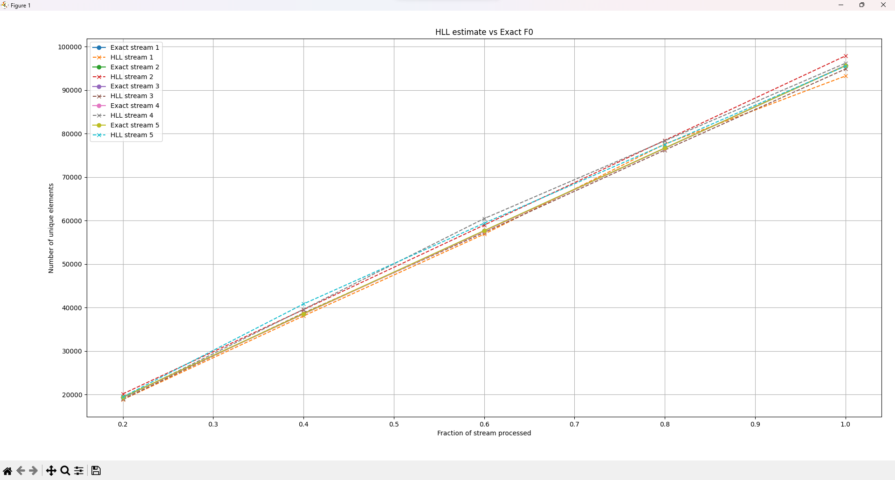
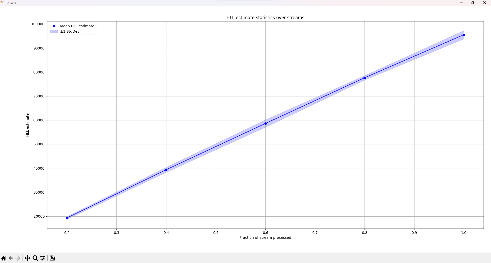
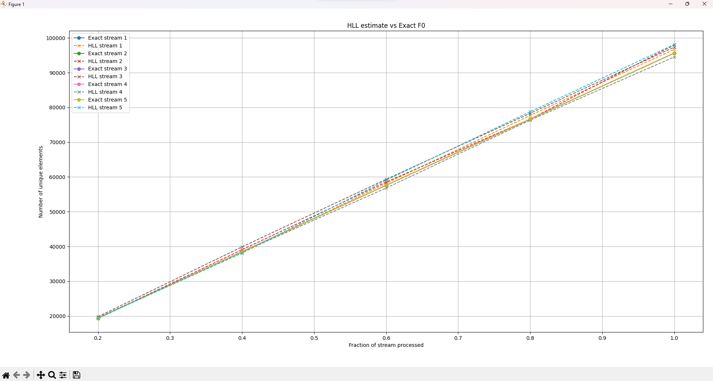
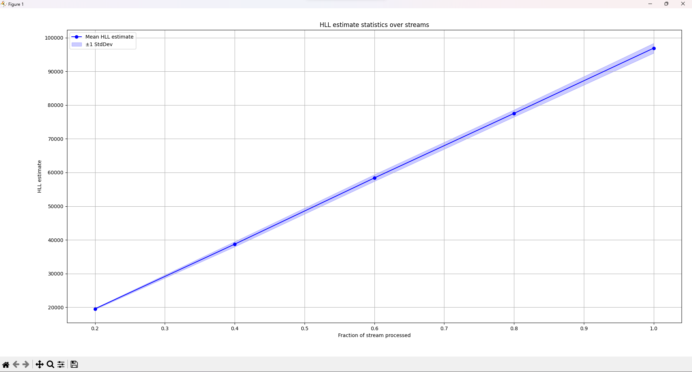

# HyperLogLog Remastered Super Deluxe Edition + 3 DLC Planed next Year

Весь исходный код, скрипты, данные и этот отчет можно найти на [Гитхабе](https://github.com/Corsiw/Data-Structures-and-Algorithms/tree/main/SET5/A3)

---

## Этап 1. Создание инфраструктуры
Написал код инфраструктурный код для дальнейших тестов HyperLogLog.

Смотрим -> [A3.cpp](A3.cpp)

Hash реализован через MurMurHash3.
Также проведена проверка хеш-функции. Это реализовано путем сравнения ожидаемого
количества чисел с конкретным числом лидирующих нулей и полученного с помощью нашей хеш-функции. Данные усреднены по 5 прогонам.

Данные сгенерированы через TestLeadingZeros в [A3.cpp](A3.cpp).
Сами данные -> [leading_zeros.csv](leading_zeros.csv). График получен через [Python-скрипт](hashTest.py).

Можно наблюдать небольшое отклонение по важному для HLL параметру.

---

## Этап 2. Реализация и оценка точности стандартного алгоритма HyperLogLog
Реализация HLL все еще смотрим -> [A3.cpp](A3.cpp)

Выбрана `B = 10`, за 1кб вектор, мы получаем точность
$$ \frac{1.04}{\sqrt{1024}} = 3.25 \% $$
Достаточно для точной оценки. Большая точность для потока размера $10^5$ избыточна. При этом при `B = 10`
мы избегаем Bias для первых битов.

Тесты проведены на 5 потоках $10^5$ в 5 точках t = {0.2, 0.4, 0.6, 0.8, 1.0}.
Данные сохранены в [HLL vs Exact](graph1_data.csv) и [Stats](graph2_data.csv).

Графики построены [Python-скриптом](HyperLogLog.py)

---

## Этап 3. Анализ результатов работы стандартного алгоритма HyperLogLog
### Точность
На наших усредненных [данных](graph2_data.csv) можно увидеть получившееся отклонение: 

| frac | Mean_HLL | Mean_Exact | Relative error                          | Теоретический RSE (1.04) | Теоретический RSE (1.3) |
| ---- | -------- | ---------- |-----------------------------------------| ------------------------ | ----------------------- |
| 0.2  | 19296.6  | 19362      | (19362-19296.6)/19362 = 0.0034 = 0.34%  | 3.25%                    | 4.06%                   |
| 0.4  | 39344.7  | 38540.4    | (39344.7-38540.4)/38540.4 = 0.021 = 2.1%| 3.25%                    | 4.06%                   |
| 0.6  | 58584.4  | 57633.4    | 0.0165 = 1.65%                          | 3.25%                    | 4.06%                   |
| 0.8  | 77612.8  | 76652.6    | 0.0127 = 1.27%                          | 3.25%                    | 4.06%                   |
| 1    | 95522.2  | 95635.6    | 0.0012 = 0.12%                          | 3.25%                    | 4.06%                   |
Все ошибки лежат в пределах теоретических RSE, даже в консервативной оценке 4.1%. Это значит, что алгоритм даёт точные оценки, с отклонением,
ожидаемым для HyperLogLog.

### Стабильность
По тем же данным видно, что **стандартное отклонение** растет пропорционально размеру потока, но рост линеен, причем с константой около 1.
Это согласуется с теорией и дает стабильный алгоритм. Отклонения есть, но они ожидаемы и контролируемы.  
Главное, что **относительная ошибка** постоянна и так же находится в пределах теоретической оценки.

### Константы
`B = 10 - m = 1024` регистров

Память: `1024 * 8 бит = 1 кБ` - очень мало, экономично.

RSE = 3.25% - приемлемо для потоков $10^5$ элементов.

Остаток битов `L−B = 22 бит` - распределение лидирующих нулей близко к идеальной геометрической форме, HLL корректно оценивает $N_t$.

Увеличение `B` - уменьшение ошибки, но больше памяти.
Уменьшение `B` - экономия памяти, но растёт ошибка и дисперсия.  
`B` следует подбирать от размера входных данных, чтобы ограничить коллизии субпотоков.
---

## Этап 4 (опциональный). Усовершенствования HyperLogLog
Ой, я сначала сделал, а потом увидел (опциональный) :)  
Новый код можно увидеть -> [A3 - v2.0](A3M.cpp)

### Улучшение 1. bit-stacking

Самое простое с 'намеком' из условия.
Заменил ``std::vector<uint8>`` на отдельную структуру данных, где провел bit-packing.

Если рассматривать ``B = 10``, то в регистрах могут лежать значения от 1 до 23 (первая единичка с 1-base индексацией), тогда 5 бит нам хватит.
Упаковываем по 5 бит в uint64 и делаем обертку с удобным доступом.

Расчет экономии:
1. $\left\lfloor \frac{64}{5} \right\rfloor = 12$ регистров в одном uint64_t,
2. $\left\lceil \frac{1024}{12} \right\rceil = 86$ uint64_t нужно на 1024 регистра,
3. $ 86 \cdot 8 = 688$ байт
4. $\frac{1024-688}{1024} \approx 32.8 \%$

При другом ``B`` немного другие цифры, но порядок экономии одинаковый.

В итоге мы за счет небольшого вычислительного оверхеда для получения индексов выиграли 32.8% памяти нашего вектора.

### Улучшение 2. MultiHLL
Используя знания теорвера приведу объяснение.

Если возьмем K независимых хеш-функций и проведем с ними HLL на одних и тех же данных,
усредняя оценки, можем добиться уменьшения ошибки.
Bias по мат ожиданию очевидно не появится, мат ожидание суммы равно сумме мат ожиданий.  
Теперь Дисперсия:
$$ Var(\frac{1}{K} \sum_{i=1}^K N^{(i)}) = \frac{1}{K^2} \sum_{i=1}^K Var(N^{(i)}) = \frac{1}{K^2} \cdot K \cdot Var(N) = \frac{1}{K} Var(N)$$

Таким образом, K прогонов уменьшат дисперсию в K раз. Тогда относительное отклонение уменьшится в $\sqrt K$ раз. Что эквивалентно увеличению `m` (количества регистров) в K раз,
но без риска получить Bias от хеш-функции.

Понятно, что в линейном исполнении мы теряем в скорости, пропорционально числу прогонов, но можно это и распараллелить.

Написал MultiHyperLogLog (смотрим все [там же](A3M.cpp)), который является оберткой над контейнером с HLL, раздающий независимые хеш-функции.

[Результаты 1](graph1_dataM.csv) и [Результаты 2](graph2_dataM.csv)

### Анализ

| frac | Mean_HLL | Mean_Exact | Relative error | Теоретический RSE (1.04) | Теоретический RSE (1.3) |
| ---- |----------|------------|----------------|--------------------------|-------------------------|
| 0.2  | 19528.2  | 19341.2    | 0.97 %         | 1.625%                   | 2.03%                   |
| 0.4  | 38718.2  | 38496.2    | 0.58 %         | 1.625%                   | 2.03%                   |
| 0.6  | 58379.9  | 57602.2    | 1.35 %         | 1.625%                   | 2.03%                   |
| 0.8  | 77552.3  | 76648.2    | 1.18 %         | 1.625%                   | 2.03%                   |
| 1    | 96919.5  | 95619.6    | 1.36 %         | 1.625%                   | 2.03%                   |
1. Точность укладывается в новую теоретическую оценку.
2. Дисперсия аналогично точности.
3. Константы аналогичны с обычным алгоритмом. Новое только `Число прогонов в MHLL` = 4, на нем наглядно видно,
что точность находится в пределах новой теоретической оценки MHLL, среднее отклонение аналогично снижается, а гипотеза подтверждается.

