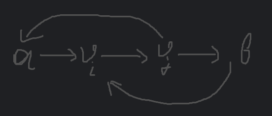

# Блиц

## 1. Дейкстра

При релаксации будет вместо `dist[v] > dist[u] + weight` использовать `dist[v] > dist[u] * weight`.  
Также dist[start] зададим 1.0, пустой путь имеет длину 1.

```c++
vector<double> DijkstraMULT(int n, int start,
                            vector<vector<pair<int,double>>>& adj) {
    const double INF = 1e100;
    vector<double> dist(n, INF);

    dist[start] = 1.0;

    priority_queue<
        pair<double,int>,
        vector<pair<double,int>>,
        greater<>
    > pq;

    pq.push({1.0, start});

    while (!pq.empty()) {
        auto [d, u] = pq.top();
        pq.pop();

        if (d > dist[u]) continue;

        for (auto [v, w] : adj[u]) {
            if (dist[v] > dist[u] * w) {
                dist[v] = dist[u] * w;
                pq.push({dist[v], v});
            }
        }
    }

    return dist;
}
```

### Когда алгоритм корректен?

В обычном алгоритме Дейкстры проблемы возникают с отрицательными рёбрами.  
Можем получить ситуацию, что вершина уже не в очереди, а новый путь оказался короче.

Формально это свойство монотонности.  
`После извлечения вершины из очереди её расстояние окончательно.`

Если сможем соблюсти это условие на некотором множестве графов, то на нем наш алгоритм будет искать 'кратчайшие пути'.

При умножении расстояние будет монотонно не убывать, если все веса будут $\ge 1$.

Таким образом наш алгоритм корректен на графах G(V, E):
$$\forall e \in E: w(e) \ge 1$$
При соблюдении остальных ограничений алгоритма Дейкстры.

Контрпример:

```
start --(10)--> A
A --(2)--> B --(0.1)--> С --(0.1)--> A
```

Это аналогично отрицательному циклу в обычном алгоритме Дейкстры.

## 2. Восстановление графа

Будем опираться на неориентированный граф без отрицательных циклов.  
Ребро (i, j) нужно в графе тогда и только тогда, когда:
$$\forall k \neq i,j: dist[i][j] < dist[i][k] + dist[k][j]$$

То есть нет такой вершины k, через которую можно пройти и получить dist[i][j].

Алгоритм:

```c++
vector<vector<pair<int,int>>> 
RestoreGraph(int n, vector<vector<int>>& dist) {

    // Проверка корректности
    for (int i = 0; i < n; ++i) {
        if (dist[i][i] != 0)
            throw invalid_argument("Invalid matrix");

        for (int j = 0; j < n; ++j) {
            if (dist[i][j] != dist[j][i])
                throw invalid_argument("Not symmetric");
        }
    }

    for (int k = 0; k < n; ++k)
        for (int i = 0; i < n; ++i)
            for (int j = 0; j < n; ++j)
                if (dist[i][j] > dist[i][k] + dist[k][j])
                    throw invalid_argument("Triangle violated");

    // Восстановление
    vector<vector<pair<int,int>>> adj(n);

    for (int i = 0; i < n; ++i) {
        for (int j = i + 1; j < n; ++j) {

            bool necessary = true;

            for (int k = 0; k < n; ++k) {
                if (k == i || k == j) continue;

                if (dist[i][j] == dist[i][k] + dist[k][j]) {
                    necessary = false;
                    break;
                }
            }

            if (necessary) {
                adj[i].push_back({j, dist[i][j]});
                adj[j].push_back({i, dist[i][j]});
            }
        }
    }

    return adj;
}
```

Алгоритм корректен, т.к. если ребро добавлено, то
$$\forall k \neq i,j: dist[i][j] < dist[i][k] + dist[k][j]$$
Существует единственный способ реализовать расстояние - прямое ребро.  
Если же ребро не добавлено, то существует альтернативный путь той же длины.

Сложность алгоритма $O(n^3)$.

### Возможно ли всегда восстановить?

Не всегда возможно восстановить исходный граф (с учетом того, что изначально рассматриваем графы без отр. циклов),
так как могут существовать ребра, не попавшие ни в одно кратчайшее расстояние.

Пример:

```
A --10-- B 
 \       |
  10000  10
    \    |
      \  |
         C
```

`dist[A][B] = 10`  
`dist[A][C] = 20`  
`dist[B][C] = 10`  
Ребро A-C никак не восстановить по `dist[][]`.

## 3. Алгоритм Флойда-Уоршелла

Ошибка в том, что цикл по k должен быть внешним.
Пример правильной реализации:

```c++
void FloydWarshall(std::vector<std::vector<int64_t> >& dist) {

  for (int k = 0; k < dist.size(); ++k) {
    for (int i = 0; i < dist.size(); ++i) {
      for (int j = 0; j < dist.size(); ++j) {
        if (dist[i][k] != LONG_LONG_MAX && dist[k][j] != LONG_LONG_MAX) {
          dist[i][j] = std::min(dist[i][j], dist[i][k] + dist[k][j]);
        }
      }
    }
  }
}
```

При реализации из задания нарушается инвариант:  
`После завершения итерации по k в качестве промежуточных вершин разрешены только {1,…,k}.`

### Пример с частичной трассировкой

Начальная матрица:

| - | 1        | 2        | 3        | 4        | 5        |
|---|----------|----------|----------|----------|----------|
| 1 | 0        | $\infty$ | $\infty$ | $\infty$ | $\infty$ |
| 2 | $\infty$ | 0        | 9        | $\infty$ | $\infty$ |
| 3 | $\infty$ | $\infty$ | 0        | $\infty$ | 9        |
| 4 | $\infty$ | 1        | $\infty$ | 0        | $\infty$ |
| 5 | 6        | $\infty$ | $\infty$ | 7        | 0        |

При i = 1, итерации по j:  
`dist[1][1] = min(0, inf) = 0`  
`dist[1][2] = inf`  
`dist[1][3] = inf`  
`dist[1][4] = inf`  
`dist[1][5] = inf`

При i = 2, итерации по j:  
`dist[2][1] = inf`  
`dist[2][2] = min(0, inf) = 0`  
`dist[2][3] = 9`  
`dist[2][4] = inf`  
`dist[2][5] = 18`

При этом при запуске правильной версии алгоритма `dist[2][1] = 24`

## 4. Структура графа


Из такой структуры графа видно, что даже если все веса положительные, то кратчайший путь
из `a` в `b`:  
a -> $v_i$ -> $v_j$ -> b

Из `b` в `a`:  
b -> $v_i$ -> $v_j$ -> a

В целом другие вершины и дуги могут быть добавлены в структуру.  
Главное, чтобы дуги из b вели только в вершины, не соединенные с a и наоборот или добавить нулевой/отрицательный цикл,
в который входит дуга из условия.

### Ограничения алгоритмов

**Дейкстра**: полностью применим, при положительных весах.
**Беллман–Форд**: тоже применим, даже для отрицательных и нулевых весов, но понятие кратчайший путь может быть не
применимо.