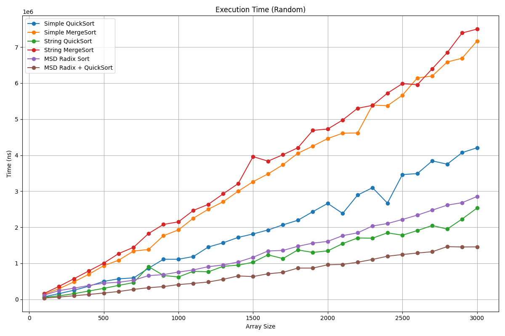
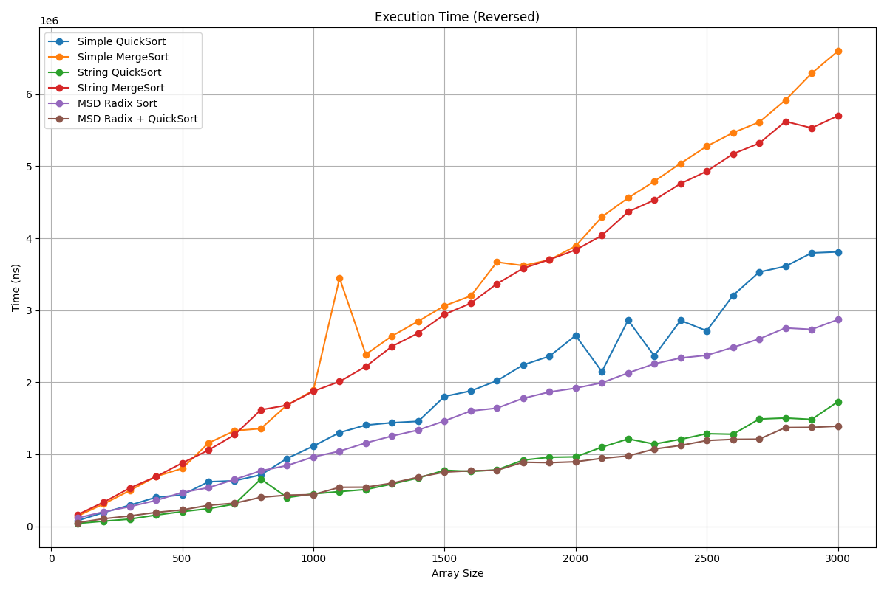
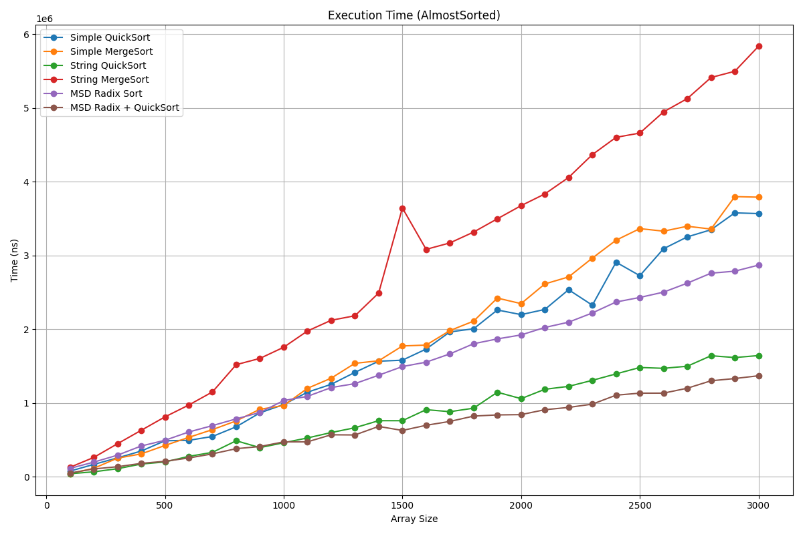
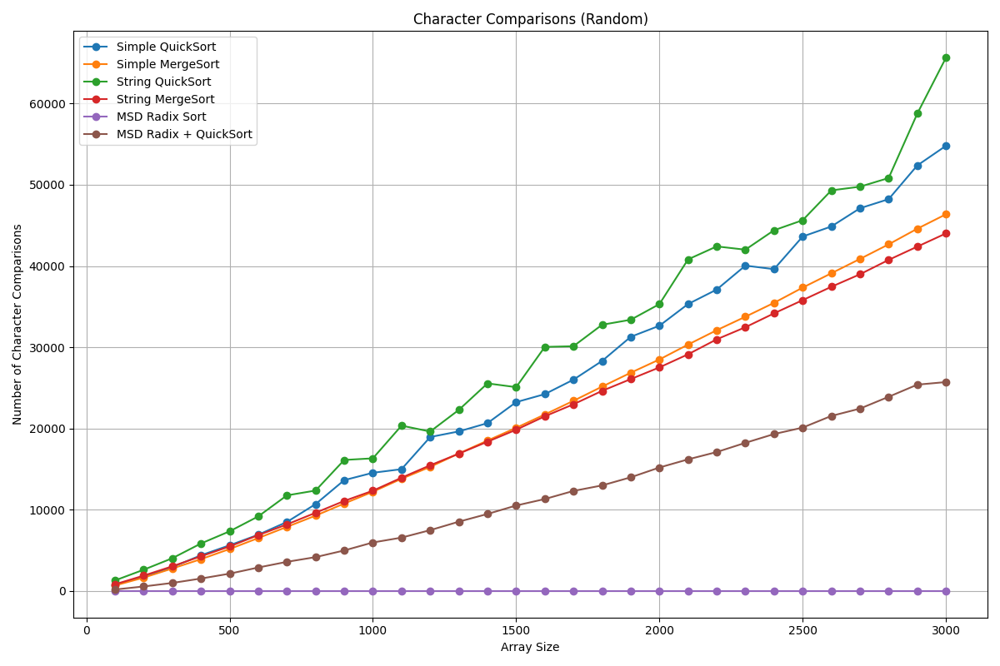
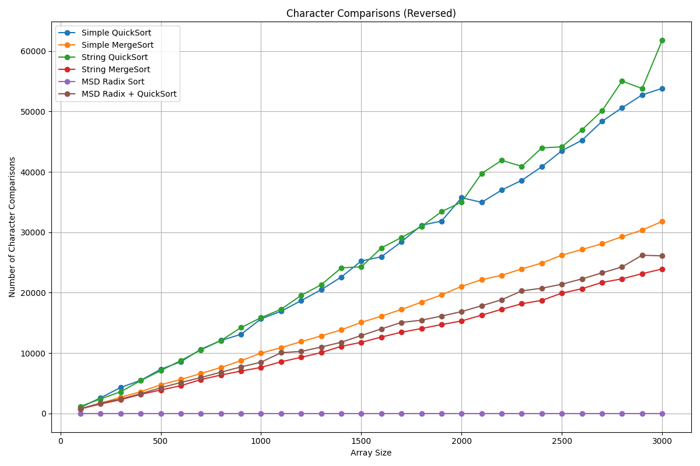
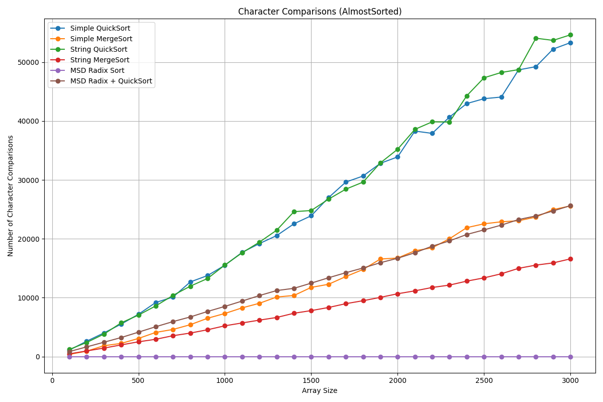

# Анализ строковых сортировок

## 0. Метадата
Выполнил Терехов Д. С. БПИ249

ID посылок на `CodeForces`:
- A1m - **375463891**
- A1q - **375173645**
- A1r - **375455091**
- A1rq - **375455261**

Ссылка на **GitHub**:
[Гитхаб](https://github.com/Corsiw/Data-Structures-and-Algorithms/tree/main/SET9)

---

## 1. О чем работа

В рамках данной работы проводится экспериментальное исследование алгоритмов сортировки строк.

## 2. Теоретическая основа

Классические алгоритмы сортировки на основе сравнений имеют сложность:

$
\Omega(n \log n)
$

Однако при работе со строками стоимость одного сравнения зависит от длины общего префикса, поэтому вводится уточнённая модель сложности:

- $N$ — количество строк,
- $DP(R)$ — суммарную длину всех различающих префиксов строк в множестве R.

Для специализированных алгоритмов используются следующие оценки:

- String QuickSort:  
  $O(DP(R) + N \log N)$

- String MergeSort:  
  $O(DP(R) + N \log N)$

- MSD Radix Sort:  
  $O(DP(R) + N \log |\Sigma|)$

- MSD RadixQuick Sort:  
  $O(DP(R) + |\Sigma|)$

---

## 3. Генерация тестовых данных

Для генерации входных данных использовался класс:

[`StringGenerator` в A1.cpp](A1.cpp)

Сгенерированы три типа наборов:

- случайные строки;
- обратно отсортированные строки;
- почти отсортированные строки.

Параметры:

- длина строк: 10–200 символов,
- размер массивов: 100–3000 с шагом 100,
- алфавит: 74 символа (A–Z, a–z, 0–9, спецсимволы).

---

## 4. Реализация алгоритмов

В работе реализованы следующие алгоритмы:

### 4.1 Стандартные алгоритмы

- QuickSort
- MergeSort

Реализация: [`A1.cpp`](A1.cpp)

---

### 4.2 Строковые алгоритмы

- String QuickSort (3-way partitioning)
- String MergeSort с использованием LCP
- MSD Radix Sort
- MSD Radix + QuickSort hybrid

Реализация: [`A1.cpp`](A1.cpp)

---

## 5. Инфраструктура эксперимента

Для проведения замеров используется класс:

[`SortTester / StringSortTester`](A1.cpp)

Функциональность:

- многократные прогоны сортировок,
- измерение времени (наносекунды),
- подсчёт посимвольных сравнений,
- расчёт медианного значения результатов.

---

## 6. Результаты экспериментов

Результаты сохранены в CSV-файлы и обработаны Python-скриптом:

[`plot.py`](plot.py)

---

### 6.1 Время выполнения

#### Random

#### Reversed

#### Almost Sorted

---

### 6.2 Количество посимвольных сравнений

#### Random

#### Reversed

#### Almost Sorted

---

## 7. Сравнение с теоретической сложностью

### 7.1 String QuickSort

**Теория:**
- $O(DP(R) + N \log N)$

**Наблюдения:**

- Видно, что в целом специализированный алгоритм показывает себя заметно лучше, чем обычный на всех типах данных. Это проявляется и по времени, и по сравнениям.
- На объеме до 3000 тысяч рост похож на линейный, что и следовало ожидать.
- Результат String QuickSort лучший во времени, среди алгоритмов на сравнениях. Но немного оставет по сравнениям. Также видно, большие колебания по сравнениям из-за RandomPartition.
- На Reversed время практически одинаковое с лучшим алгоритмом Radix + Quick. На AlmostSorted немногим хуже.

---

### 7.2 String MergeSort

**Теория:**
- $O(DP(R) + N \log N)$

**Наблюдения:**

- В целом оба MergeSort показывают результат сильно хуже, чем остальные сортировки, что ожидаемо ведь константа в оценке сложности QuickSort ниже.
- Число сравнений ожидаемо меньше, чем на обычном алгоритме. В целом выигрывает по сравнениям почти все другие алгоритмы и на всех данных.
- Время на Случайных данных несколько хуже. А на AlmostSorted вообще намного хуже всех других сортировок.

---

### 7.3 MSD Radix Sort

**Теория:**
- $O(DP(R) + N \log |\Sigma|)$

**Наблюдения:**

- Алгоритм близок к линейному росту.
- Отсутсвуют сравнения.
- По времени держится на 3 месте на всех данных. Всегда уступает String QuickSort, осбенно на Reversed и AlmostSorted.

---

### 7.4 MSD Radix + QuickSort (hybrid)

**Теория:**
- $O(DP(R) + |\Sigma|)$

**Наблюдения:**

- Лучший по времени алгоритм. Особенно заметно на случайных данных.
- По сравнениям на случаных данных на втором месте, но уступает String MergeSort на остальных данных.
- Очень близок с String QuickSort по времени на AlmostSorted и Reversed.

---

## 8. Сравнение с обычными алгоритмами

- В целом специализированные алгоритмы выигрывают практически всегда и с большим улучшением результата. При росте размеров массивов, разница только возрастет.
- String MergeSort на всех данных, кроме Reversed уступает обычной версии. Оверхед слишком большой на таких размерах массивов.
---

## 9. Вывод

- Теоритические оценки времени работы алгоритмов подтверждаются.
- Строковые версии алгоритмов сильно выигрывают у обычных версий.
- MDS Radix + QuickSort показал лучший результат на всех типах данных.
- MergeSort заметно проигрывает остальным по времени на всех данных из-за скрытой константы.
- Разные типы данных дают отличающиеся результаты, но по времени относительное расположение разных алгоритмов фактически не меняется.

- Главный практический вывод - MDS Radix + QuickSort лидирует по времени и числу сравнений. Имеет смысл использовать его, если нет каких-то уникальных паттернов в данных, которые я не рассмотривал.

---

## 10. Дополнительно

- Замеры выполнены с использованием медианы нескольких прогонов.
- Подсчёт сравнений учитывает только посимвольные операции.
- Использовался фиксированный seed для воспроизводимости результатов.

---